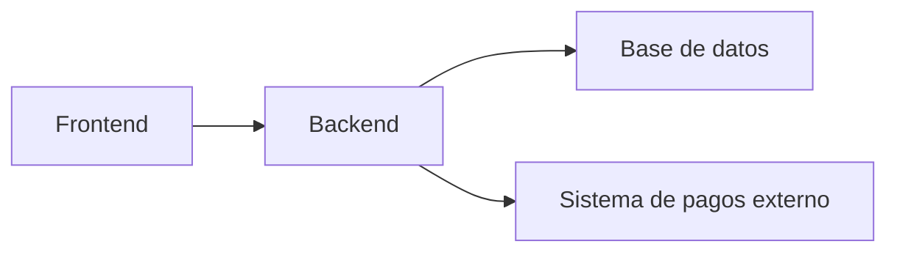

1. ENTENDER EL PROBLEMA Y REQUISITOS

Clarificación del problema: 

El problema central que este sistema resolverá es el procesamiento de transacciones en una tienda de comercio electrónico, permitiendo la funcionalidad básica de una tienda en línea, incluyendo la navegación de productos, la gestión de un carrito de compras, y la finalización del proceso de compra.

Identificación de usuarios y casos de uso: 

Hay dos tipos de usuarios identificados: 
- Usuarios finales: Pueden navegar por los productos, agregarlos a un carrito de compras, y completar una compra. 
- Administradores: Pueden gestionar el inventario, revisar pedidos, y analizar métricas.

Análisis de requisitos funcionales y no funcionales: 

Los requisitos funcionales incluyen la búsqueda y visualización de productos, la gestión de un carrito de compras, el procesamiento del pago de la orden y la actualización de inventario en tiempo real, y el envío de notificaciones de confirmación.

Los requisitos no funcionales se refieren a la escalabilidad, disponibilidad, seguridad y rendimiento del sistema.

Suposiciones y restricciones: 

Una suposición importante es que la información del producto es relativamente estática, pero el inventario cambia con frecuencia. 

Una restricción es que el sistema se integrará con un gateway de pagos externo para procesar tarjetas y otros medios.

2. ARQUITECTURA DE ALTO NIVEL

Componentes principales del sistema: 

- Frontend
- Backend
- Base de datos
- Sistema de pagos externo

Patrones de comunicación: 

El frontend se comunica con el backend para obtener información de productos y realizar operaciones de carrito. El backend se comunica con la base de datos para actualizar y recuperar datos, y con el sistema de pagos externo para procesar pagos.

DIAGRAMA DE ARQUITECTURA GENERAL:

En este diagrama, el frontend se comunica con el backend, que a su vez interactúa con la base de datos y el sistema de pagos externo. El inventario de productos se actualiza en tiempo real en la base de datos cuando se procesa el pago.