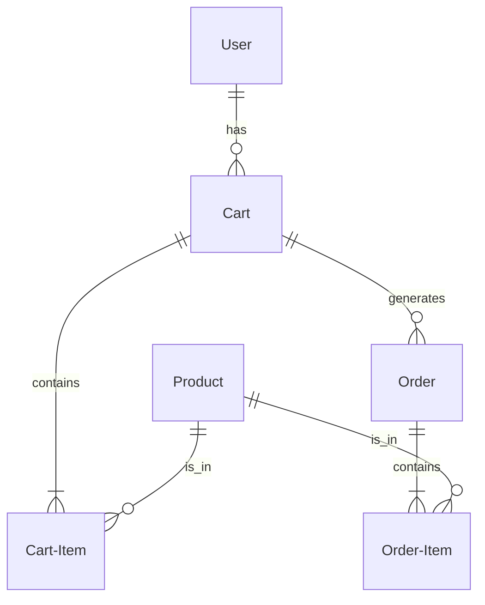
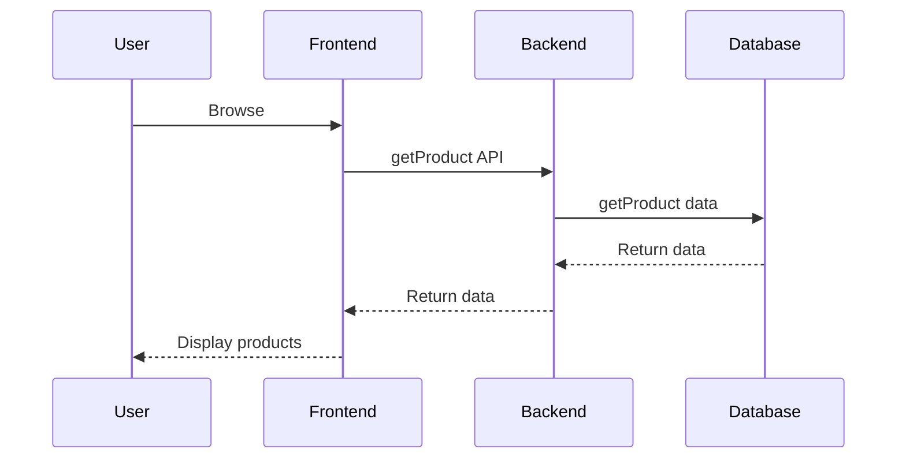

3. DISEÑO DETALLADO Y TECNOLOGÍAS

Modelado de datos:

Las principales entidades del sistema son `Usuario`, `Producto`, `Carrito` y `Pedido`.

DIAGRAMA DE BASE DE DATOS:

En este diagrama, los Usuarios tienen un Carrito, que contiene productos. Cuando se realiza un Pedido, se crea una relación entre el Carrito, el Pedido, y los Productos correspondientes.

Diseño de APIs:

Las principales APIs son `getProduct`, `addToCart`, `checkOut`, `manageInventory`, `viewOrders`, y `viewMetrics`.

Stack tecnológico detallado: 

- Lenguaje Backend: Node.js
- Frameworks: Express.js
- Base de datos: MongoDB
- Arquitectura: microservicios

La combinación de Node.js, Express.js y MongoDB proporciona un stack tecnológico ligero, eficiente y escalable, adecuado para el comercio electrónico. Utilizar una arquitectura de microservicios permite mantener cada componente del sistema modular y separado, mejorando la escalabilidad y el rendimiento.

Seguridad: 

Se implementarán medidas de seguridad como autenticación JWT, cifrado HTTPS y auditoría segura de campos sensibles en la base de datos.

Escalabilidad y rendimiento: 

El servidor web se puede escalar horizontalmente para manejar más tráfico. La arquitectura de microservicios permite la escalabilidad a nivel de componentes individuales.

DIAGRAMA DE SECUENCIA:

En este diagrama de secuencia, se muestra la interacción entre los diferentes componentes durante el proceso de visualización de productos de un usuario.