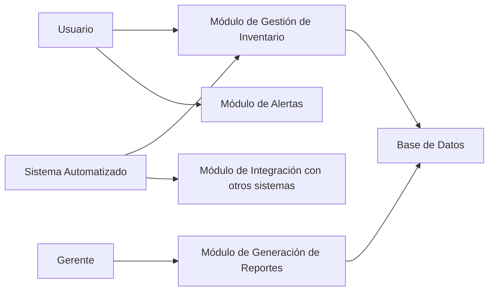

2. ARQUITECTURA DE ALTO NIVEL

- Componentes principales del sistema: El sistema estará compuesto por módulos de usuario, gestión de inventario, generación de informes y administración de alertas, así como un módulo de Integración para la interacción con otros sistemas.
- Patrones de comunicación: Los componentes del sistema se comunicarán mediante solicitudes y respuestas HTTP, utilizando una arquitectura RESTful. Los datos se intercambiarán en formato JSON.

Descripción del Diagrama: El diagrama muestra como interactúan los diferentes usuarios y componentes del sistema entre sí.