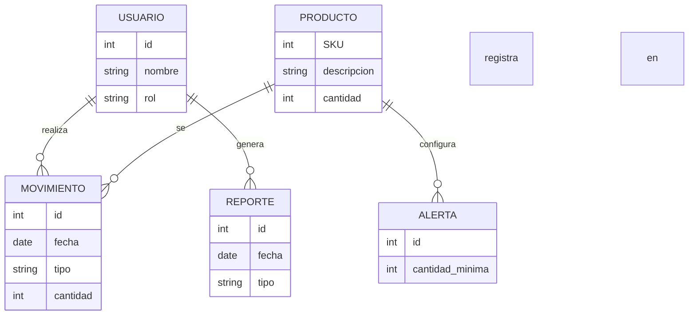

3. DISEÑO DETALLADO Y TECNOLOGÍAS

- Modelado de datos: Las principales entidades serían Usuario (Empleado, Gerente), Producto (datos del artículo y stock), Movimiento (registro de entradas y salidas de productos), Alerta (configuraciones de alerta) y Reporte.



- Diseño de APIs:
GET /api/inventario/{sku}: Devuelve los detalles del producto y el stock actual.
POST /api/inventario/{sku}/entrada: Registra una entrada de un producto.
POST /api/inventario/{sku}/salida: Registra una salida de producto.
POST /api/alertas: Configura una alerta.
GET /api/reportes/{id}: Devuelve un reporte de inventario.
- Stack tecnológico detallado: Para la implementación del backend servirá cualquier lenguaje de programación. Sin embargo, sugiero Python o Java por su amplia comunidad de desarrolladores y librerías. Para la base de datos, MySQL o PostgreSQL pueden facilitar las operaciones requeridas.
- Seguridad: JWT para autenticación y autorización. Encriptación SSL para todas las comunicaciones.
- Escalabilidad y rendimiento: Se puede implementar una arquitectura de microservicios para aislar las funcionalidades y permitir escalabilidad horizontal. El uso de un servidor de aplicaciones como Nginx puede mejorar el rendimiento.

```mermaid
sequenceDiagram
    Participante Usuario as U
    Participante Sistema as S
    Participante BaseDatos as D
    U->>S: Solicita información de producto (SKU)
    S->>D: Consulta producto y stock
    D-->>S: Devuelve información del producto
    S-->>U: Muestra información del producto
```